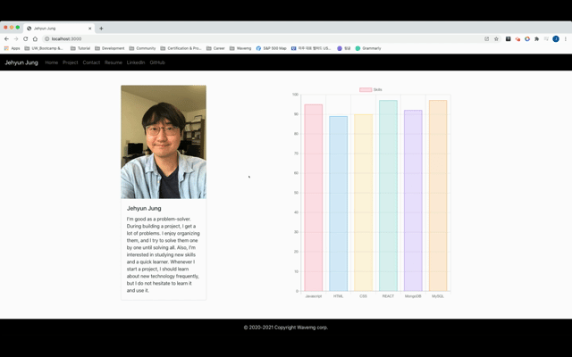

# Profile website
 

## Table of Contents
1. [Description](#Description)
2. [Usage](#Usage)
3. [Installation](#Installation)
4. [Test](#Test)
5. [Contributoring](#Contributoring)

## Description
Profile Website

## Usage
Link :  https://congmul.github.io/jehyunjung/

## Installation 
To install necessary dependencies, run the following command:

## Test 

## Contributoring
Contact me by email : congmul@hotmail.com  
Contact me by gitHub : <a href="https://github.com/congmul">congmul</a>